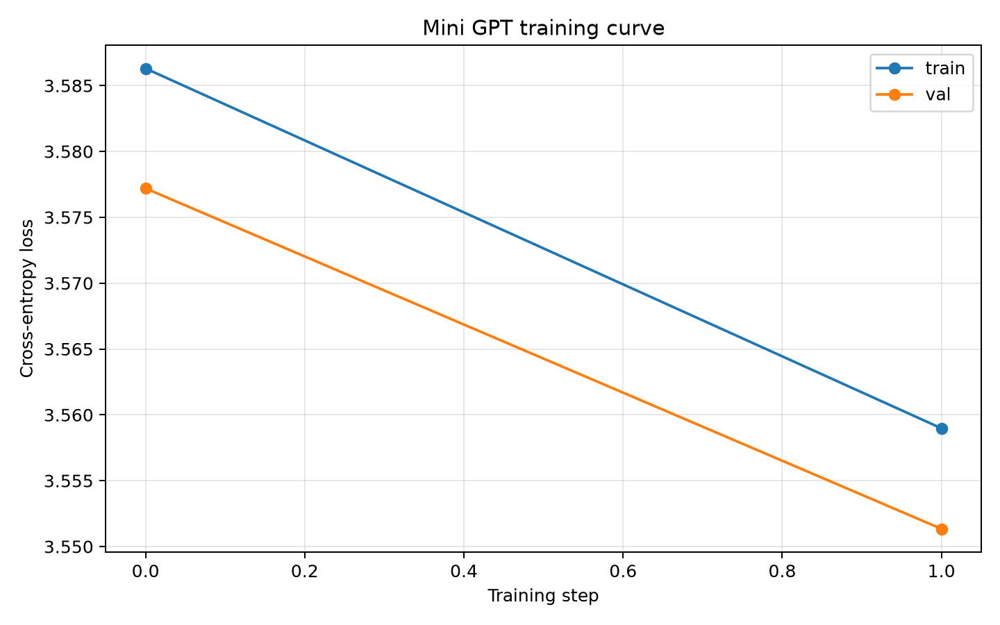
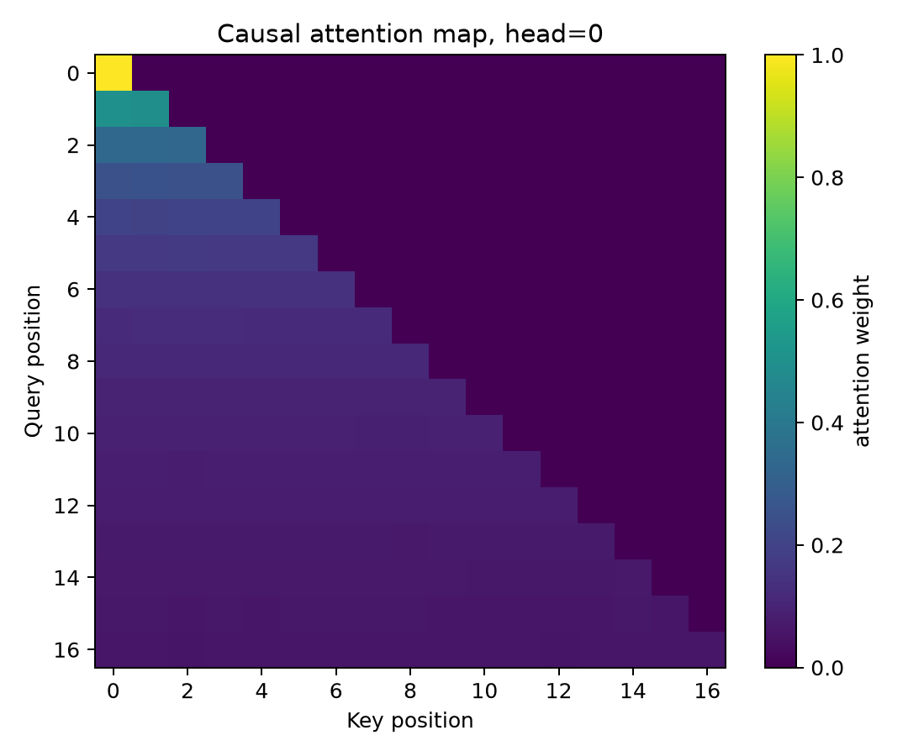

# Mini GPT From Scratch

A compact, educational GPT-style Transformer implemented from scratch in PyTorch.

The project trains a character-level language model on a tiny local corpus, generates text, visualizes the training curve, and saves an attention map. It is intentionally small enough to run on a laptop CPU.

## Implemented Features

- Character-level tokenizer
- Causal self-attention
- Transformer block with residual connections and layer normalization
- Mini GPT model with token and positional embeddings
- Training loop with AdamW
- Text generation with temperature and top-k sampling
- Checkpoint save/load
- Training curve visualization
- Attention map visualization
- Streamlit viewer
- Pytest tests

## Project Structure

```text
mini-gpt-from-scratch/
├── README.md
├── requirements.txt
├── requirements-minimal.txt
├── app.py
├── data/
│   └── tiny_corpus.txt
├── src/
│   ├── data.py
│   ├── model.py
│   ├── train.py
│   └── visualize.py
├── scripts/
│   ├── train_mini_gpt.py
│   ├── generate_text.py
│   ├── plot_attention_demo.py
│   └── run_all.py
├── results/
└── tests/
```

## Setup

```bash
python3 -m venv .venv
source .venv/bin/activate
pip install --upgrade pip
pip install -r requirements.txt
```

For a lighter install without Streamlit:

```bash
pip install -r requirements-minimal.txt
```

## Run Tests

```bash
python -m pytest -q
```

Expected result:

```text
4 passed
```

## Run All

```bash
python scripts/run_all.py
```

This creates:

```text
results/mini_gpt_checkpoint.pt
results/training_history.csv
results/training_curve.png
results/generated_text.txt
results/attention_map.png
```

## Individual Commands

Train:

```bash
python scripts/train_mini_gpt.py --max-iters 20
```

Generate text:

```bash
python scripts/generate_text.py --prompt "The " --max-new-tokens 200
```

Plot attention:

```bash
python scripts/plot_attention_demo.py
```

Streamlit viewer:

```bash
streamlit run app.py
```

## Results

### Training curve



### Attention map



Generated text is saved at:

```text
results/generated_text.txt
```

## What This Demonstrates

This repository demonstrates the core components of a GPT-like language model:

1. Convert text into token IDs
2. Train a Transformer to predict the next token
3. Use causal attention so each position can only attend to previous positions
4. Generate text autoregressively one token at a time

## Limitations

- This is an educational implementation, not a production LLM.
- It uses a tiny character-level dataset.
- It is designed for local CPU-friendly experiments.
- The generated text is not expected to be high quality without larger data and longer training.

## Implemented Extensions

The repository already includes checkpointing, generation, attention visualization, a Streamlit viewer, tests, and reusable scripts. Additional scaling work such as larger corpora or GPU training can be done by changing command-line parameters.
